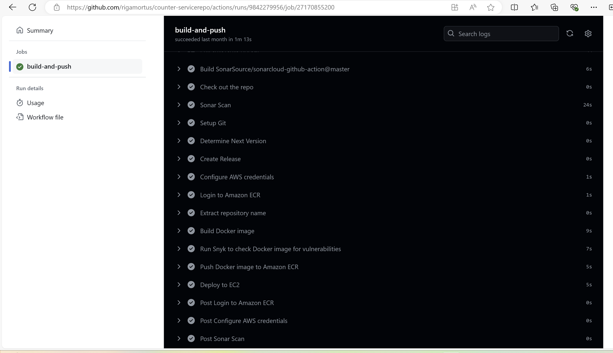
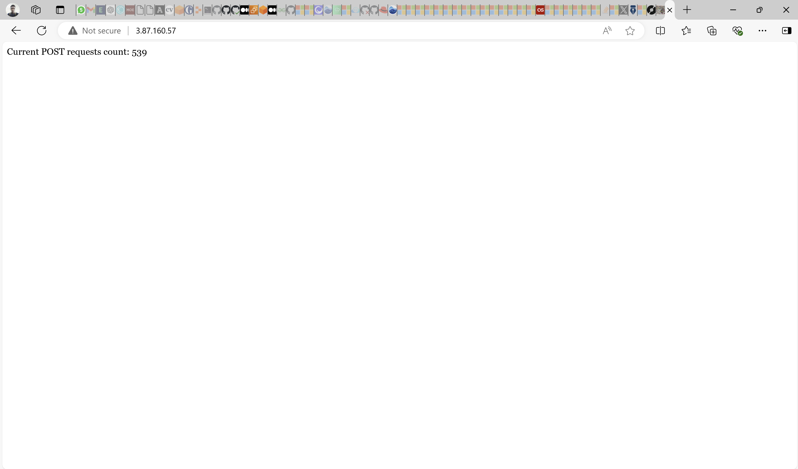

# Site Counter Service Using Github Actions, Python, & Docker

The aim of this project was to create a counter for every POST request the site has served and display it. The site's counter will be written in Python and served via a Docker container running on an EC2 instance. Github Actions will be used as the choice CI/CD tool to deploy the application.

## Python Logic

The site's counter was written using Python. The Python code is below:
#!/usr/bin/env python3
from flask import Flask, request, jsonify
import os

app = Flask(__name__)

# Define the path for the counter file to store the data in Docker Volume

```Python
COUNTER_FILE = "/data/counter.txt"

def read_counter():
    """
    Reads and returns the current counter value from the file.
    If the file doesn't exist, it return 0.
    
    Returns:
        int: The current counter value.
    """
    if os.path.exists(COUNTER_FILE):
        with open(COUNTER_FILE, "r") as f:
            return int(f.read().strip())
    else:
        return 0

def update_counter(counter):
    """
    Updates the counter file with the new counter value.
    
    Args:
        counter (int): The new counter value to write to the file.
    """
    with open(COUNTER_FILE, "w") as f:
        f.write(str(counter))

@app.route('/', methods=['GET', 'POST'])
def handle_request():
    """
    Handles GET and POST requests to the root endpoint.
    GET request returns the current count of POST requests.
    POST request increments the counter and returns the updated count.
    
    Returns:
        str: The response message with the current or updated counter.
    """
    counter = read_counter()
    if request.method == 'POST':
        # Increment the counter for each POST request and update the file.
        counter += 1
        update_counter(counter)
        return f"POST requests counter updated. Current count: {counter}"
    else:
        # For GET requests, just return the current count.
        return f"Current POST requests count: {counter}"

@app.route('/health', methods=['GET'])
def health_check():
    """
    Performs a simple health check of the application.
    It tries to read the counter file as a basic check.
    
    Returns:
        tuple: A JSON response indicating the health status and the HTTP status code.
    """
    try:
        # Basic health check: Ensure the counter file is accessible.
        read_counter()
        return jsonify({"status": "healthy"}), 200
    except Exception as e:
        # Return an unhealthy status if any error occurs, e.g., file access issues.
        return jsonify({"status": "unhealthy", "reason": str(e)}), 500
```

if __name__ == '__main__':
    # Run the Flask app with binding to all interfaces on port 8080.
    # Debug mode is turned off for production use.
    app.run(host='0.0.0.0', port=8080, debug=False)
Four major functions were employed in the code's (__counter-service.py__) logic:

__read_counter()__: This function performs continuous reads of the counter service file (__/data/counterservice.txt__). If the file doesn't exist, it returns an integer value of __0__.

__update_counter()__: This function handles the update of the counter service file.

__handle_request()__: It monitors GET and POST HTTP methods. The GET method returns the current number of POST requests. The POST method helps increment the counter.

__health_check()__: Monitors the health of the counter service application.


## Creating the Dockerfile

A Dockerfile is required to containerize application. First, all the package dependencies necessary to run the application are noted in a __requirements.txt__ file. It was created using the command:

```Python
pip3 freeze requirments.txt
```

Next, a Dockerfile was created. The Dockerfile syntax is as follows:

```Dockerfile

ARG PYTHON_VERSION=3.13.0b3
FROM python:${PYTHON_VERSION}-alpine3.19 AS base

# Prevents Python from writing pyc files.
ENV PYTHONDONTWRITEBYTECODE=1

# Keeps Python from buffering stdout and stderr to avoid situations where
# the application crashes without emitting any logs due to buffering.
ENV PYTHONUNBUFFERED=1

WORKDIR /app

# Create a non-privileged user that the app will run under.
# See https://docs.docker.com/go/dockerfile-user-best-practices/
ARG UID=10001
RUN adduser \
    --disabled-password \
    --gecos "" \
    --home "/nonexistent" \
    --shell "/sbin/nologin" \
    --no-create-home \
    --uid "${UID}" \
    appuser

# Download dependencies as a separate step to take advantage of Docker's caching.
# Leverage a cache mount to /root/.cache/pip to speed up subsequent builds.
# Leverage a bind mount to requirements.txt to avoid having to copy them into
# into this layer.
RUN --mount=type=cache,target=/root/.cache/pip \
    --mount=type=bind,source=requirements.txt,target=requirements.txt \
    python -m pip install -r requirements.txt

# Switch to the non-privileged user to run the application.
USER appuser

# Copy the source code(counter-service.py) into the container.
COPY counter-service.py .

# Expose the port that the application listens on.
# In most Unix-like operating systems, binding to ports below 1024 requires elevated privileges.
# This application runs on Docker as an appuser, which is restricted to binding to ports below 1024.
EXPOSE 8080

# Run the application.Logs enabled to see the output logs
CMD ["gunicorn", "counter-service:app", "--bind", "0.0.0.0:8080", "--access-logfile", "-", "--error-logfile", "-"]

```

For the above script, some important bits to note are:


- The base image __PYTHON_VERSION=3.13.0b3-alpine3.19__ was used due to vulnerability considerations. It was suggested by the Snyk tool during the CI/CD phase of this project.
- The port 8080 was used to serve the application since it is traditionally used in enterprise environments.
- The ```COPY counter-service.py .``` was used instead of ```COPY . .``` inline with security best practices.
- Log output was also enabled


## EC2 Host for the Application 

An EC2 instance with Ubuntu 22.04 as the OS was created to host the Docker container. A security group was attached to the EC2 instance to allow HTTP traffic on port 80 & 8080 respectively. Port 22 was also opened to enable SSH connection.


Docker client was also installed on the EC2 instance (docker-ce, docker-ce-cli, and containerd.io ).

## ECR Repository
An ECR repository was created in __us-east-1__ region .
A role granting the EC2 instance access to the ECR repository was also created and attached to the EC2 instance.

## Github Actions Workflow - CI

Github Actions was used as the CI/CD tool for this task. The complete workflow is as follows:

```YAML

name: Build and Push Docker image to AWS ECR

on:
  push:
    branches:
      - master
  workflow_dispatch:
    inputs:
      name:
        description: 'David'
        required: true

jobs:
  build-and-push:
    runs-on: ubuntu-latest

    steps:
    - name: Check out the repo
      uses: actions/checkout@v2
      with:
        fetch-depth: 0 # Necessary to fetch all tags and history
        
    - name: Sonar Scan
      uses: SonarSource/sonarcloud-github-action@master
      env:
        GITHUB_TOKEN: ${{ secrets.GIT_ACCESS_TOKEN }}
        SONAR_TOKEN: ${{ secrets.SONAR_TOKEN }}
        
    - name: Setup Git
      run: |
        git config --global user.name 'github-actions'
        git config --global user.email 'github-actions@github.com'
        
    - name: Determine Next Version
      id: next_version
      run: |
        # Fetch all tags
        git fetch --tags
        
        # Get the latest tag, assume semver, and sort.
        LATEST_TAG=$(git tag -l | grep -E '^v[0-9]+\.[0-9]+\.[0-9]+$' | sort -V | tail -n1)
        
        # If there's no tag yet, start with v0.0.0. Used for new repos
        if [ -z "$LATEST_TAG" ]; then
          LATEST_TAG="v0.0.0"
        fi
        
        # Increment the patch version
        NEXT_TAG=$(echo $LATEST_TAG | awk -F. '{print $1"."$2"."$3+1}')
        
        # Output the next version
        echo "::set-output name=tag::$NEXT_TAG"
        echo "Next version: $NEXT_TAG"

###                     CREATE RELEASE                       ###
###  Creating release with the tag from the previous step 
    - name: Create Release
      id: create_release
      uses: actions/create-release@v1
      env:
        GITHUB_TOKEN: ${{ secrets.GIT_ACCESS_TOKEN }}
      with:
        tag_name: ${{ steps.next_version.outputs.tag }}
        release_name: Release ${{ steps.next_version.outputs.tag }}
        draft: false
        prerelease: false
###                  BUILD DOCKER IMAGE                      ###
###         Build Docker image from the Dockefile            ###
################################################################

    - name: Configure AWS credentials
      uses: aws-actions/configure-aws-credentials@v1
      with:
        aws-access-key-id: ${{ secrets.AWS_ACCESS_KEY_ID }}
        aws-secret-access-key: ${{ secrets.AWS_SECRET_ACCESS_KEY }}
        aws-region: us-east-1

    - name: Login to Amazon ECR
      id: login-ecr
      uses: aws-actions/amazon-ecr-login@v1

    - name: Extract repository name
      id: repo-name
      run: |
        REPO_NAME="${GITHUB_REPOSITORY##*/}"
        echo "REPO_NAME=$REPO_NAME" >> $GITHUB_ENV
        echo "::set-output name=repo_name::$REPO_NAME"

    - name: Build Docker image
      env:
        ECR_REGISTRY: ${{ steps.login-ecr.outputs.registry }}
        ECR_REPOSITORY: ${{ env.REPO_NAME }}
        IMAGE_TAG: ${{ steps.next_version.outputs.tag }}
      run: |
        docker build -t $ECR_REGISTRY/$ECR_REPOSITORY:$IMAGE_TAG .
        echo "IMAGE_NAME=$ECR_REGISTRY/$ECR_REPOSITORY:$IMAGE_TAG" >> $GITHUB_ENV
        
    - name: Run Snyk to check Docker image for vulnerabilities
      uses: snyk/actions/docker@master
      env:
        SNYK_TOKEN: ${{ secrets.SNYK_TOKEN }}
      with:
         image: ${{ env.IMAGE_NAME }}
         args: --severity-threshold=high --policy-path=.snyk
      continue-on-error: false
      
###########################################################
###                  PUSH IMAGE TO ECR                  ###
###     Tag Docker image as "latest" and push to ECR    ###
########################################################### 

    - name: Push Docker image to Amazon ECR
      env:
        ECR_REGISTRY: ${{ steps.login-ecr.outputs.registry }}
        ECR_REPOSITORY: counter-servicerepo
        IMAGE_TAG: ${{ steps.next_version.outputs.tag }}
      run: |
        docker tag $ECR_REGISTRY/$ECR_REPOSITORY:$IMAGE_TAG $ECR_REGISTRY/$ECR_REPOSITORY:latest
        docker push $ECR_REGISTRY/$ECR_REPOSITORY:$IMAGE_TAG
        docker push $ECR_REGISTRY/$ECR_REPOSITORY:latest
```

## CI - Notes
- The pipeline is triggered either manually (__workflow_dispatch__) or on push to the __master__ branch. 

- CI step includes only one job (__build-and-push__). The first step using an action to checkout to the main branch and fetch tags and branch history

- Git is configured, tags are fetched, and the latest tag is also set. If the latest tag doesn't exist, it is set to v0.0.0. Patch version logic is also implemented to increase the patch version number.

- A release is created using Github access token

- A Docker image is built, an ECR login is executed, and the image is pushed to the ECR gallery.

- Sonarcloud and Snyk steps are also included to check the image for vulnerabilities and make corrections.

## GitHub Actions Workflow - CD

The CD (continuous deployment) part of the workflow pulls the application image from ECR, establishes an SSH login to the EC2 instance and deploys the application.

```YAML
    - name: Deploy to EC2
      env:
        EC2_PEM_KEY: ${{ secrets.EC2_PEM_KEY }}
        EC2_HOST: ${{ secrets.EC2_HOST }}
        EC2_USER: ${{ secrets.EC2_USER }}
        ECR_REGISTRY: ${{ steps.login-ecr.outputs.registry }}
        ECR_REPOSITORY: counter-servicerepo
        IMAGE_TAG: ${{ steps.next_version.outputs.tag }}
      run: |
        # Save PEM key to file and set permissions
        echo "$EC2_PEM_KEY" > ec2.pem
        chmod 400 ec2.pem

        # SSH, SCP commands
        SSH_COMMAND="ssh -i ec2.pem -o StrictHostKeyChecking=no $EC2_USER@$EC2_HOST"
        SCP_COMMAND="scp -i ec2.pem -o StrictHostKeyChecking=no"

        #Login to the Docker Registry (ECR)
        $SSH_COMMAND "aws ecr get-login-password --region us-east-1 | docker login --username AWS --password-stdin $ECR_REGISTRY"
        
        # Copy docker-compose.yml to EC2 server
        $SCP_COMMAND docker-compose.yml $EC2_USER@$EC2_HOST:/home/ubuntu/docker/
        
        # Pull and run the Docker container on EC2
        $SSH_COMMAND "cd /home/ubuntu/docker/ && docker pull $ECR_REGISTRY/$ECR_REPOSITORY:$IMAGE_TAG && docker compose -f docker-compose.yml up -d --force-recreate"
        
        # Cleanup PEM key
        rm -f ec2.pem
```

The CI/CD workflow ran successfully and deployed the containerized Docker application to the EC2 instance


To test the application, a the Linux tool, __curl__ was used to execute a POST method to the public IP of the EC2 instance:

```bash
curl -X POST http://3.87.160.57/
```

The counter service file is updated after the above command and the count is reflected on accessing the IP address of the EC2 instance:

